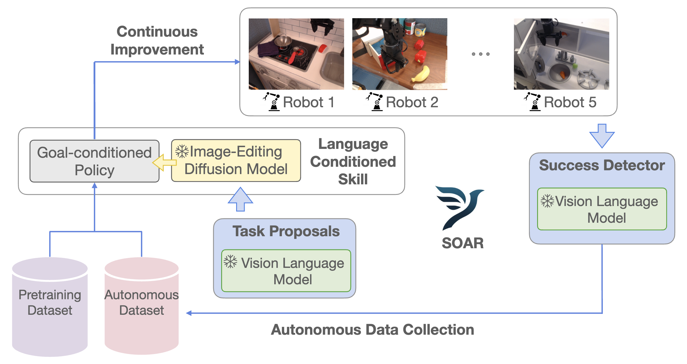

# SOAR
Code release for the paper "Autonomous Improvement of Instruction Following Skills via Foundation Models".

This repository contains two components: (1) the VLM powered semantics-aware autonomous data collection pipeline, (2) converting the collected raw data into the RLDS format, and (3) Jax/Flax code for training the policies used in the paper.

## SOAR-Data

We have released SOAR-Data for public access [here](https://rail.eecs.berkeley.edu/datasets/soar_release/1.0.0/).
We also provided a download script to download the dataset in RLDS format, which requires 136G of disk space.
In this directory, run
```bash
bash soar_data/download_dataset.sh
```
This script should take around 20 minutes to download if you use the parallel download option, and we recommend downloading inside a tmux session.

## (1) Autonomous Data Collection

We provide a ready-to-use implementation of autonomous data collection on a fleet of WidowX robot arms. This data collection system is designed around deploying instruction following policies at scale to collect autonomous datasets that are semantically relevant, diverse, and large. Special care is taken to minimize human supervision during data collection, with features like automatic reset detection (and subsequent Slack notification).



### Installation
```
cd data_collection
conda create -n orchestrator python=3.10
conda activate orchestrator
pip install -r requirements.txt
pip install -e .
```

### VLM Server Hosting
You have the option to either host CogVLM on a local server for inference, or use GPT-4V/o. This specification can be made in the configs (see `README.md` under `data_collection/config`). If you are running autonomous data collection with multiple robots, you can host the VLM just once, and all data collection scripts will query this server.

If you are hosting CogVLM, make sure the port specified in the last line of the file `data_collection/orchestrator/cogvlm_server/main.py` matches the port specified in `data_collection/config/<robot_name>/cogvlm_server.yaml`. Then, on the machine you want to host the VLM server run `python main.py` from the `data_collection/orchestrator/cogvlm_server` directory. The VLM requires around 48 GB of memory.

We provide convenience scripts for testing that the VLM has been hosted correctly and for setting up a proxy server (i.e., to get around firewalls) which are located in the same directory.

### OpenAI API Key

Make sure to specify your OpenAI API key as an environment variable with the name `OPENAI_API_KEY`. It is likely convenient to include this specification in your `.bashrc` file.

### SuSIE Server

Similar to the VLM server, you will need to host the SuSIE model on a machine accessible to the robot machines. The memory requirement is much more modest, taking up around 6 GB. Make sure the port specified in the last line of the file `data_collection/orchestrator/susie_server/main.py` matches the port specified in the config `data_collection/config/<robot_name>/subgoal_predictor.yaml`. To launch the SuSIE server, run `python orchestrator/susie_server/main.py --config_dir config/<robot_config_dir>` from the `data_collection` directory, specifying the path to the folder containing your robot's configs.

### Web Viewer

To make it convenient to monitor your robots from anywhere, we include a Flask web server with a simple front-end displaying video streamed by your robots. It is mandatory to launch the web server. There are two parts to launching this web viewer: (1) launch the Flask server on a central machine, and (2) launch the data streaming RosPy script on each of your robots.

To launch the Flask web server, run `python app.py` from the directory `data_collection/orchestrator/web_viewer`. The default port for the web server is `5000`, which can be adjusted in the last line of the file `app.py`.

Separately on your robot machine (the machine where you are running the docker container and action server from `bridge_data_robot`), launch the script `python orchestrator/web_viewer/ros_client/run_client.py --config_dir config/<robot_config_dir>` from the `data_collection` directory, making sure the specify the path to the appropriate configuration directory. This command should be run after the docker container and action server from `bridge_data_robot` have been launched (see the README in the `bridge_data_robot` repo for more instructions).

### Pre-data collection: Setting Workspace Boundaries for Robot

The final step before launching data collection is to specify the workspace boundaries for your robot. Specifying workspace boundaries (as the dimensions of an invisible rectangular prism the end-effector is forced to stay inside of) helps with safe robot operation and minimizes the chances that the robot will do something requiring a manual environment reset.

Run the script `python orchestrator/set_workspace_bounds/teleop.py --config_dir config/<robot_config_dir>` from the `data_collection` directory. This will instantiate a keyboard teleop script (the key controls of which will be printed once you run the script). You should then teleop the end-effector to the extremums of your workspace. Hitting `q` will terminate the script, and print out the minimum and maximim `x`, `y`, and `z` values defining the invisible rectangular prism boundary. You should enter these values in your robot `general_params` config file: `data_collection/config/<robot_config_dir>/general_params.yaml`.

### Running the Robot

Finally you are ready to run autonomous data collection on the robot! Simply run the following script:
```
python orchestrator/robot/main.py --config_dir config/<robot_config_dir>
```
from the `data_collection` directory. The script `main.py` contains the code for iterating through the full autonomous data collection loop: querying the VLM for which task to command, querying the SuSIE server for a subgoal image, rolling out the policy, querying the VLM for success determination, and logging. You should be able to keep this script and the robot running for many hours at a time, potentially periodically resetting a fallen object in the robot's environment.

## Model Training

## RLDS Data Conversion
We convert the raw data logged in the `data_collection/*` directories into the commonly used RLDS format. The conversion code is
located in the `rlds_converter` directory. See [rlds_converter/README.md](https://github.com/rail-berkeley/soar/blob/main/rlds_converter/README.md) for more information.

## Contributing
To enable code checks and auto-formatting, please install pre-commit hooks (run this in the root directory):
```bash
pre-commit install
```
The hooks should now run before every commit. If files are modified during the checks, you'll need to re-stage them and commit again.
